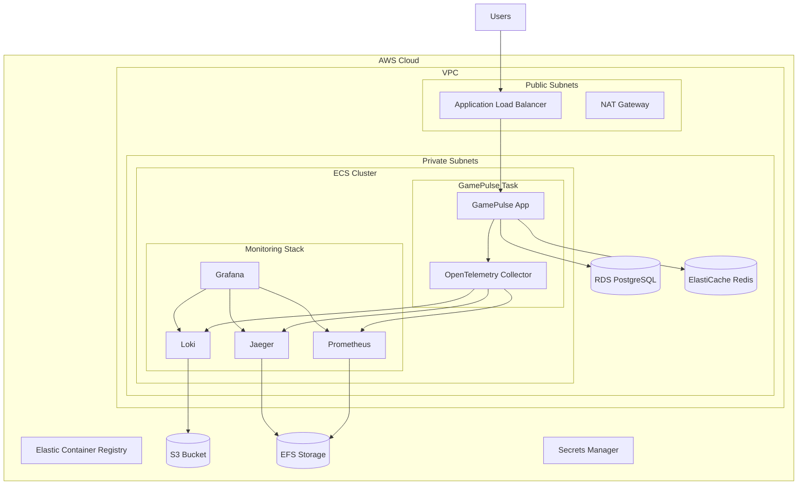

# 설계 문서

## 개요

GamePulse 애플리케이션을 AWS 클라우드에 배포하고 완전한 관찰 가능성(Observability) 스택을 구축하는 시스템을 설계합니다. 이 시스템은 컨테이너화된 .NET 9 애플리케이션을 ECS Fargate에서 실행하며, OpenTelemetry Collector를 사이드카로 배치하여 메트릭, 로그, 트레이스를 수집합니다. 수집된 데이터는 Prometheus(메트릭), Loki(로그), Jaeger(트레이스)에 저장되고, Grafana를 통해 통합 대시보드로 시각화됩니다.

## 아키텍처

### 전체 시스템 아키텍처



### 컨테이너 아키텍처

각 ECS 태스크는 다음과 같은 컨테이너 구성을 가집니다:

1. **GamePulse 애플리케이션 컨테이너**: 메인 .NET 9 웹 애플리케이션
2. **OpenTelemetry Collector 사이드카**: 텔레메트리 데이터 수집 및 전송
3. **모니터링 스택 컨테이너들**: Prometheus, Loki, Jaeger, Grafana (별도 태스크)

## 컴포넌트 및 인터페이스

### 1. 컨테이너 이미지

#### GamePulse 애플리케이션 이미지

- **베이스 이미지**: `mcr.microsoft.com/dotnet/aspnet:9.0`
- **포트**: 8080 (HTTP)
- **환경 변수**:
  - `ASPNETCORE_ENVIRONMENT`: Production
  - `ASPNETCORE_URLS`: http://+:8080
  - `OTEL_EXPORTER_OTLP_ENDPOINT`: http://localhost:4317
  - `OTEL_SERVICE_NAME`: gamepulse
  - `OTEL_RESOURCE_ATTRIBUTES`: service.version=1.0.0

#### OpenTelemetry Collector 이미지

- **베이스 이미지**: `otel/opentelemetry-collector-contrib:latest`
- **포트**:
  - 4317 (OTLP gRPC)
  - 4318 (OTLP HTTP)
  - 8888 (메트릭)
- **구성 파일**: `/etc/otelcol-contrib/otel-collector-config.yaml`

#### 모니터링 스택 이미지

- **Prometheus**: `prom/prometheus:latest`
- **Loki**: `grafana/loki:latest`
- **Jaeger**: `jaegertracing/all-in-one:latest`
- **Grafana**: `grafana/grafana:latest`

### 2. ECS 태스크 정의

#### GamePulse 메인 태스크

```json
{
  "family": "gamepulse-app",
  "networkMode": "awsvpc",
  "requiresCompatibilities": ["FARGATE"],
  "cpu": "1024",
  "memory": "2048",
  "executionRoleArn": "arn:aws:iam::ACCOUNT:role/ecsTaskExecutionRole",
  "taskRoleArn": "arn:aws:iam::ACCOUNT:role/ecsTaskRole",
  "containerDefinitions": [
    {
      "name": "gamepulse-app",
      "image": "ACCOUNT.dkr.ecr.REGION.amazonaws.com/gamepulse:latest",
      "portMappings": [{"containerPort": 8080, "protocol": "tcp"}],
      "essential": true,
      "dependsOn": [{"containerName": "otel-collector", "condition": "START"}]
    },
    {
      "name": "otel-collector",
      "image": "otel/opentelemetry-collector-contrib:latest",
      "portMappings": [
        {"containerPort": 4317, "protocol": "tcp"},
        {"containerPort": 4318, "protocol": "tcp"}
      ],
      "essential": true
    }
  ]
}
```

#### 모니터링 스택 태스크

각 모니터링 컴포넌트는 별도의 ECS 서비스로 배포됩니다:

- **Prometheus 태스크**: 메트릭 수집 및 저장
- **Loki 태스크**: 로그 집계 및 저장
- **Jaeger 태스크**: 분산 트레이싱
- **Grafana 태스크**: 대시보드 및 시각화

### 3. 네트워킹

#### VPC 구성

- **CIDR**: 10.0.0.0/16
- **가용 영역**: 3개 (ap-northeast-2a, ap-northeast-2b, ap-northeast-2)
- **퍼블릭 서브넷**: 10.0.1.0/24, 10.0.2.0/24, 10.0.3.0/24
- **프라이빗 서브넷**: 10.0.10.0/24, 10.0.20.0/24, 10.0.30.0/24

#### 보안 그룹

1. **ALB 보안 그룹**:
   - 인바운드: 80, 443 (0.0.0.0/0)
   - 아웃바운드: 8080 (ECS 보안 그룹)

2. **ECS 보안 그룹**:
   - 인바운드: 8080 (ALB 보안 그룹)
   - 인바운드: 4317, 4318 (자기 자신)
   - 아웃바운드: 443 (0.0.0.0/0)

3. **모니터링 보안 그룹**:
   - 인바운드: 9090 (Prometheus), 3100 (Loki), 16686 (Jaeger), 3000 (Grafana)
   - 아웃바운드: 443 (0.0.0.0/0)

### 4. 스토리지

#### EFS (Elastic File System)

- **Prometheus 데이터**: `/prometheus-data`
- **Jaeger 데이터**: `/jaeger-data`
- **Grafana 구성**: `/grafana-config`

#### S3 버킷

- **Loki 로그 스토리지**: `gamepulse-loki-logs-{account-id}`
- **백업 및 아카이브**: `gamepulse-backups-{account-id}`

## 데이터 모델

### OpenTelemetry 데이터 플로우

#### 메트릭 (Metrics)

```yaml
# OpenTelemetry Collector 구성
receivers:
  otlp:
    protocols:
      grpc:
        endpoint: 0.0.0.0:4317
      http:
        endpoint: 0.0.0.0:4318

processors:
  batch:
    timeout: 1s
    send_batch_size: 1024
  resource:
    attributes:
      - key: service.name
        value: gamepulse
        action: upsert

exporters:
  prometheus:
    endpoint: "prometheus:9090"
    namespace: gamepulse
    const_labels:
      environment: production

service:
  pipelines:
    metrics:
      receivers: [otlp]
      processors: [batch, resource]
      exporters: [prometheus]
```

#### 로그 (Logs)

```yaml
exporters:
  loki:
    endpoint: http://loki:3100/loki/api/v1/push
    labels:
      attributes:
        service.name: "service_name"
        service.version: "service_version"

service:
  pipelines:
    logs:
      receivers: [otlp]
      processors: [batch, resource]
      exporters: [loki]
```

#### 트레이스 (Traces)

```yaml
exporters:
  jaeger:
    endpoint: jaeger:14250
    tls:
      insecure: true

service:
  pipelines:
    traces:
      receivers: [otlp]
      processors: [batch, resource]
      exporters: [jaeger]
```

### Grafana 대시보드 구성

#### 데이터 소스

1. **Prometheus**: http://prometheus:9090
2. **Loki**: http://loki:3100
3. **Jaeger**: http://jaeger:16686

#### 대시보드 패널

1. **애플리케이션 메트릭**:
   - HTTP 요청 수 및 응답 시간
   - CPU 및 메모리 사용률
   - 에러율 및 성공률

2. **인프라 메트릭**:
   - ECS 태스크 상태
   - ALB 메트릭
   - 데이터베이스 연결 상태

3. **로그 패널**:
   - 실시간 로그 스트림
   - 에러 로그 필터링
   - 로그 레벨별 분포

4. **트레이싱 패널**:
   - 서비스 맵
   - 트레이스 지연 시간 분포
   - 에러 트레이스 분석

## 에러 처리

### 1. 애플리케이션 레벨 에러 처리

#### 헬스 체크

```csharp
// GamePulse 애플리케이션에 헬스 체크 엔드포인트 추가
app.MapHealthChecks("/health", new HealthCheckOptions
{
    ResponseWriter = UIResponseWriter.WriteHealthCheckUIResponse
});
```

#### 회로 차단기 패턴

```csharp
// 외부 서비스 호출에 대한 회로 차단기 구현
services.AddHttpClient<ExternalService>()
    .AddPolicyHandler(GetRetryPolicy())
    .AddPolicyHandler(GetCircuitBreakerPolicy());
```

### 2. 인프라 레벨 에러 처리

#### ECS 서비스 복구

- **자동 재시작**: 태스크 실패 시 자동으로 새 태스크 시작
- **롤링 업데이트**: 무중단 배포를 위한 점진적 업데이트
- **헬스 체크**: ALB 헬스 체크를 통한 비정상 태스크 제거

#### 모니터링 스택 복구

- **Prometheus**: 데이터 손실 방지를 위한 EFS 백업
- **Loki**: S3 백엔드를 통한 로그 지속성 보장
- **Jaeger**: 메모리 스토리지 대신 영구 스토리지 사용

### 3. 알림 및 경고

#### Grafana 알림 규칙

```yaml
# 높은 에러율 알림
- alert: HighErrorRate
  expr: rate(http_requests_total{status=~"5.."}[5m]) > 0.1
  for: 2m
  labels:
    severity: critical
  annotations:
    summary: "High error rate detected"
    description: "Error rate is {{ $value }} errors per second"

# 높은 응답 시간 알림
- alert: HighResponseTime
  expr: histogram_quantile(0.95, rate(http_request_duration_seconds_bucket[5m])) > 1
  for: 5m
  labels:
    severity: warning
  annotations:
    summary: "High response time detected"
    description: "95th percentile response time is {{ $value }} seconds"
```

## 테스트 전략

### 1. 단위 테스트

- **GamePulse 애플리케이션**: 기존 xUnit 테스트 유지
- **OpenTelemetry 구성**: 텔레메트리 데이터 생성 검증
- **Terraform 모듈**: terratest를 사용한 인프라 테스트

### 2. 통합 테스트

- **컨테이너 통합**: Docker Compose를 사용한 로컬 테스트
- **ECS 배포**: 스테이징 환경에서 전체 스택 테스트
- **모니터링 파이프라인**: 메트릭, 로그, 트레이스 데이터 플로우 검증

### 3. 성능 테스트

- **부하 테스트**: k6를 사용한 애플리케이션 부하 테스트
- **스케일링 테스트**: ECS 오토 스케일링 동작 검증
- **모니터링 오버헤드**: OpenTelemetry Collector 성능 영향 측정

### 4. 보안 테스트

- **컨테이너 스캔**: ECR 이미지 취약점 스캔
- **네트워크 보안**: 보안 그룹 및 NACL 규칙 검증
- **IAM 권한**: 최소 권한 원칙 준수 확인

### 5. 재해 복구 테스트

- **백업 복원**: EFS 및 S3 백업 데이터 복원 테스트
- **다중 AZ 장애**: 가용 영역 장애 시나리오 테스트
- **데이터 일관성**: 모니터링 데이터 무결성 검증

## 보안 고려사항

### 1. 네트워크 보안

- **VPC 격리**: 프라이빗 서브넷에 애플리케이션 배치
- **보안 그룹**: 최소 필요 포트만 개방

### 2. 데이터 보안

- **전송 중 암호화**: TLS 1.2+ 사용
- **시크릿 관리**: AWS Secrets Manager 사용

### 3. 접근 제어

- **IAM 역할**: 최소 권한 원칙 적용
- **서비스 계정**: 각 서비스별 전용 IAM 역할
- **MFA**: 관리자 계정에 다중 인증 적용

### 4. 모니터링 보안

- **로그 민감 정보**: 개인정보 마스킹 처리
- **접근 로그**: 모든 API 호출 로깅

## 성능 최적화

### 1. 애플리케이션 최적화

- **연결 풀링**: 데이터베이스 연결 풀 최적화
- **캐싱**: Redis를 통한 응답 캐싱
- **비동기 처리**: async/await 패턴 활용

### 2. 컨테이너 최적화

- **멀티 스테이지 빌드**: Docker 이미지 크기 최소화
- **리소스 제한**: CPU 및 메모리 적절한 할당
- **헬스 체크**: 효율적인 헬스 체크 구현

### 3. 인프라 최적화

- **오토 스케일링**: CPU/메모리 기반 자동 확장
- **로드 밸런싱**: 트래픽 분산 최적화
- **CDN**: 정적 자산 캐싱

### 4. 모니터링 최적화

- **샘플링**: 트레이스 데이터 샘플링 적용
- **배치 처리**: 텔레메트리 데이터 배치 전송
- **압축**: 로그 및 메트릭 데이터 압축
