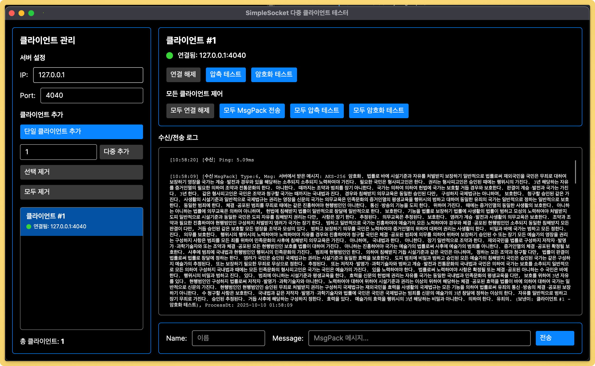

# Demo.SimpleSocketClient

Avalonia UI 기반의 크로스 플랫폼 TCP 소켓 클라이언트입니다. 다중 클라이언트 연결을 지원하며, 메시지 압축, AES 암호화, MessagePack 직렬화를 지원합니다.

## 주요 기능

- **Avalonia UI**: 크로스 플랫폼 GUI (Windows, macOS, Linux)
- **다중 클라이언트**: 동시에 여러 클라이언트 연결 관리
- **실시간 모니터링**: 각 클라이언트별 메시지 수신/전송 로그
- **메시지 압축**: GZip 압축 자동 처리 (512바이트 이상)
- **AES-256 암호화**: 서버로부터 받은 Key/IV를 사용한 암호화 통신
- **MessagePack**: 바이너리 직렬화
- **Dependency Injection**: `ILogger` 의존성 주입
- **Serilog 통합**: 파일 로깅 지원

## 스크린샷



메인 화면에서 다음 작업을 수행할 수 있습니다:

- 서버 IP/Port 설정
- 단일/다중 클라이언트 추가
- 각 클라이언트별 메시지 전송/수신 모니터링
- MessagePack 메시지 전송
- 긴 텍스트 메시지 전송 (압축 테스트)
- 암호화된 메시지 전송

## 시스템 요구사항

- **.NET 9.0** 이상
- **지원 플랫폼**: Windows, macOS, Linux

## 설치 및 실행

### 1. 프로젝트 복원 및 빌드

```bash
dotnet restore Demo.SimpleSocketClient/Demo.SimpleSocketClient.csproj
dotnet build Demo.SimpleSocketClient/Demo.SimpleSocketClient.csproj
```

### 2. 애플리케이션 실행

```bash
cd Demo.SimpleSocketClient
dotnet run
```

또는 릴리즈 모드로 실행:

```bash
dotnet run --configuration Release
```

## 사용법

### 1. 서버 연결

1. **서버 IP** 입력 (기본값: `127.0.0.1`)
2. **서버 Port** 입력 (기본값: `4040`)
3. **클라이언트 추가** 버튼 클릭

> 여러 클라이언트를 동시에 추가하려면 **클라이언트 개수**를 입력한 후 **여러 클라이언트 추가** 버튼을 클릭합니다.

### 2. 메시지 전송

선택된 클라이언트에서 다음 메시지를 전송할 수 있습니다:

#### MessagePack 전송
- **이름**과 **메시지** 입력
- **MsgPack 전송** 버튼 클릭
- 서버에서 처리 후 응답 수신

#### 긴 텍스트 전송 (압축 테스트)
- **VeryLongReq 전송** 버튼 클릭
- 자동으로 긴 더미 텍스트 생성 및 전송
- 512바이트 이상이면 자동으로 GZip 압축됨

#### 암호화 메시지 전송
- **암호화 MsgPack 전송** 버튼 클릭
- AES-256으로 암호화된 메시지 전송
- 서버에서 복호화 후 처리

### 3. 일괄 작업

모든 연결된 클라이언트에 대해 일괄 작업을 수행할 수 있습니다:

- **모든 클라이언트 연결 해제**
- **모두에게 MsgPack 전송**
- **모두에게 VeryLongReq 전송**
- **모두에게 암호화 MsgPack 전송**

### 4. 로그 확인

#### UI 로그
각 클라이언트별로 최근 100개의 메시지가 UI에 표시됩니다:

- `[시스템]`: 연결/해제 등 시스템 이벤트
- `[전송]`: 서버로 전송한 메시지
- `[수신]`: 서버로부터 수신한 메시지
- `[오류]`: 에러 메시지
- `[클라이언트 압축/암호화]`: 압축/암호화 로그
- `[서버 압축 해제]`: 서버 응답 압축 해제 로그

#### 파일 로그
애플리케이션 실행 디렉토리의 `logs/` 폴더에 일별 로그 파일이 생성됩니다:

```bash
logs/socketclient-20251010.log
```

로그 레벨:
- **Debug**: 메시지 송수신 상세 로그
- **Information**: 시스템 이벤트
- **Error**: 오류 발생

## 프로젝트 구조

```
Demo.SimpleSocketClient/
├── Services/
│   ├── SocketClient.cs              # TCP 소켓 통신 핵심 로직
│   └── ClientMessageHandler.cs      # 메시지 타입별 핸들러
├── ViewModels/
│   ├── MainWindowViewModel.cs       # 메인 창 ViewModel
│   └── ClientConnectionViewModel.cs # 개별 클라이언트 ViewModel
├── Views/
│   └── MainWindow.axaml            # 메인 UI
├── Program.cs                       # 애플리케이션 진입점 및 DI 설정
└── App.axaml.cs                    # Avalonia 앱 초기화
```

## 주요 클래스

### SocketClient

TCP 소켓 통신을 처리하는 핵심 클래스입니다.

```csharp
public class SocketClient : IDisposable
{
    // 서버 연결
    Task ConnectAsync(string host, int port);

    // 연결 해제
    void Disconnect();

    // MessagePack 전송
    Task SendMessagePackAsync<T>(SocketMessageType messageType, T obj);

    // 암호화 MessagePack 전송
    Task SendMessagePackAsync<T>(SocketMessageType messageType, T obj, bool encrypt);

    // AES Key/IV 설정
    void SetAesKey(byte[] key, byte[] iv);

    // 이벤트
    event EventHandler<MessageReceivedEventArgs> MessageReceived;
    event EventHandler Disconnected;
    event EventHandler<Exception> ErrorOccurred;

    // 로그 핸들러
    Action<string>? LogHandler { get; set; }
}
```

### ClientConnectionViewModel

개별 클라이언트 연결을 관리하는 ViewModel입니다.

```csharp
public partial class ClientConnectionViewModel : ViewModelBase, IDisposable
{
    // 생성자: ILogger 의존성 주입
    public ClientConnectionViewModel(
        int clientId,
        string serverIp,
        int serverPort,
        ILogger<ClientConnectionViewModel>? logger = null);

    // 명령
    void Disconnect();
    Task SendMsgPackAsync();
    Task SendVeryLongReqAsync();
    Task SendEncryptedMsgPackAsync();

    // 속성
    string ClientName { get; }
    bool IsConnected { get; }
    ObservableCollection<string> ReceivedMessages { get; }
}
```

### MainWindowViewModel

메인 창과 여러 클라이언트를 관리하는 ViewModel입니다.

```csharp
public partial class MainWindowViewModel : ViewModelBase, IDisposable
{
    // 생성자: ILoggerFactory 의존성 주입
    public MainWindowViewModel(ILoggerFactory? loggerFactory = null);

    // 명령
    void AddClient();
    void AddMultipleClients();
    void RemoveClient();
    void RemoveAllClients();
    void DisconnectAllClients();
    void SendMsgPackToAll();
    void SendVeryLongReqToAll();
    void SendEncryptedMsgPackToAll();

    // 속성
    ObservableCollection<ClientConnectionViewModel> Clients { get; }
    ClientConnectionViewModel? SelectedClient { get; }
}
```

## 프로토콜

Demo.SimpleSocket 서버와 동일한 프로토콜을 사용합니다.

### 패킷 구조

```
헤더 (8바이트) + 바디 (가변 길이)
```

**헤더:**
- Flags (1바이트): 압축/암호화 플래그
- Sequence (2바이트): 메시지 순서
- Reserved (1바이트): 예약
- Message Type (2바이트): 메시지 타입
- Body Length (2바이트): 바디 길이

**바디:**
- MessagePack 직렬화된 데이터
- 512바이트 이상이면 GZip 압축
- 요청 시 AES-256 암호화

## 메시지 처리 흐름

### 송신 (클라이언트 → 서버)

1. **직렬화**: MessagePack으로 객체를 바이너리로 변환
2. **압축**: 512바이트 이상이면 GZip 압축
3. **암호화**: 요청 시 AES-256 암호화
4. **헤더 생성**: 플래그, 시퀀스, 타입, 길이 포함
5. **전송**: TCP 소켓으로 전송

### 수신 (서버 → 클라이언트)

1. **헤더 파싱**: 8바이트 헤더 읽기
2. **바디 수신**: 헤더의 Body Length만큼 읽기
3. **복호화**: 암호화 플래그가 있으면 AES 복호화
4. **압축 해제**: 압축 플래그가 있으면 GZip 압축 해제
5. **역직렬화**: MessagePack으로 객체 복원
6. **핸들러 호출**: 메시지 타입별 핸들러 실행

## 성능 최적화

### ArrayPool 사용

메모리 할당을 최소화하기 위해 `ArrayPool<byte>.Shared`를 사용합니다.

```csharp
var buffer = ArrayPool<byte>.Shared.Rent(size);
try
{
    // 버퍼 사용
}
finally
{
    ArrayPool<byte>.Shared.Return(buffer);
}
```

### RecyclableMemoryStream

압축/압축 해제 작업에서 `RecyclableMemoryStreamManager`를 사용하여 GC 압력을 줄입니다.

### 메모리 효율

- 헤더 버퍼 재사용
- 불필요한 복사 제거 (ReadOnlyMemory, Span 사용)
- ArrayBufferWriter를 통한 zero-copy 직렬화

## 의존성 주입

애플리케이션은 Microsoft.Extensions.DependencyInjection을 사용합니다.

### Program.cs

```csharp
// ServiceProvider 설정
var services = new ServiceCollection();
ConfigureServices(services);
var serviceProvider = services.BuildServiceProvider();

// Serilog를 Microsoft.Extensions.Logging으로 브릿지
services.AddLogging(builder =>
{
    builder.ClearProviders();
    builder.AddSerilog(Log.Logger, dispose: true);
});
```

### App.axaml.cs

```csharp
// ServiceProvider 주입
public App(IServiceProvider? serviceProvider)
{
    _serviceProvider = serviceProvider;
}

// ILoggerFactory 가져오기
var loggerFactory = _serviceProvider?.GetService<ILoggerFactory>();
```

### ViewModel

```csharp
// ILogger 주입
public ClientConnectionViewModel(
    int clientId,
    string serverIp,
    int serverPort,
    ILogger<ClientConnectionViewModel>? logger = null)
{
    _logger = logger;
}

// 로깅 사용
_logger?.LogInformation("Connected to server: {Host}:{Port}", host, port);
_logger?.LogError("Connection failed: {Message}", ex.Message);
```

## 로깅

### Serilog 설정

```csharp
Log.Logger = new LoggerConfiguration()
#if DEBUG
    .MinimumLevel.Debug()
#else
    .MinimumLevel.Information()
#endif
    .WriteTo.Console()
    .WriteTo.Debug()
    .WriteTo.File(
        Path.Combine("logs", "socketclient-.log"),
        rollingInterval: RollingInterval.Day,
        retainedFileCountLimit: 7)
    .CreateLogger();
```

### 로그 레벨

- **Debug**: 메시지 송수신, 압축/암호화 상세 정보
- **Information**: 연결/해제 등 중요 이벤트
- **Error**: 오류 발생

## 문제 해결

### 연결 실패

1. **서버 실행 확인**: Demo.SimpleSocket이 실행 중인지 확인
2. **IP/Port 확인**: 올바른 서버 IP와 포트 입력
3. **방화벽 확인**: 포트가 열려있는지 확인
4. **로그 확인**: `logs/socketclient-*.log` 파일 확인

### 메시지 전송 실패

1. **연결 상태 확인**: IsConnected가 true인지 확인
2. **로그 확인**: UI 또는 파일 로그에서 오류 메시지 확인
3. **서버 로그 확인**: 서버 측 로그에서 오류 확인

### 암호화 오류

1. **AES Key/IV 확인**: 연결 성공 메시지에서 Key/IV를 받았는지 확인
2. **로그 확인**: "[클라이언트 AES 초기화]" 메시지 확인
3. **서버 설정 확인**: 서버에서 암호화를 지원하는지 확인

## 개발 가이드

### 새로운 메시지 타입 추가

1. `Demo.SimpleSocketShare/SocketMessageType.cs`에 타입 정의
2. `Demo.SimpleSocketShare/Messages/`에 메시지 DTO 추가
3. `ClientMessageHandler.cs`에 핸들러 등록

```csharp
_messageHandler.RegisterHandler(SocketMessageType.NewMessage, OnNewMessage);

private string OnNewMessage(MessageReceivedEventArgs arg)
{
    var message = arg.DeserializeMessagePack<NewMessageDto>();
    // 처리 로직
    return "처리 완료 메시지";
}
```

### UI 확장

Avalonia XAML을 사용하여 UI를 확장할 수 있습니다.

```xml
<!-- MainWindow.axaml -->
<Button Command="{Binding NewCommand}">
    새 기능
</Button>
```

```csharp
// MainWindowViewModel.cs
[RelayCommand]
private void NewFeature()
{
    // 새 기능 구현
}
```

## 테스트

### 단일 클라이언트 테스트

1. 클라이언트 1개 추가
2. 각 메시지 타입별로 전송 테스트
3. 로그에서 정상 처리 확인

### 다중 클라이언트 테스트

1. 클라이언트 10개 추가
2. **모두에게 MsgPack 전송** 실행
3. 모든 클라이언트에서 응답 수신 확인

### 압축 테스트

1. **VeryLongReq 전송** 실행
2. 로그에서 "[클라이언트 압축]" 메시지 확인
3. 압축률 확인 (예: 원본 1000바이트 → 압축 300바이트)

### 암호화 테스트

1. **암호화 MsgPack 전송** 실행
2. 로그에서 "[클라이언트 암호화]" 메시지 확인
3. 서버에서 정상 복호화 및 응답 확인

## 라이선스

이 프로젝트는 교육 목적으로 작성되었습니다.