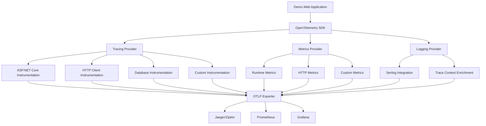

# Demo.Web OpenTelemetry 구현 가이드

## 개요

이 문서는 Demo.Web 프로젝트에 OpenTelemetry를 성공적으로 도입한 과정과 실제 구현 코드 예제를 제공합니다. 분산 추적(Distributed Tracing), 메트릭(Metrics), 로깅(Logging)을 통한 완전한 관찰 가능성(Observability) 솔루션을 구현했습니다.

## 목차

1. [아키텍처 개요](#아키텍처-개요)
2. [핵심 구성 요소](#핵심-구성-요소)
3. [설정 및 구성](#설정-및-구성)
4. [실제 구현 코드](#실제-구현-코드)
5. [환경별 설정](#환경별-설정)
6. [성능 최적화](#성능-최적화)
7. [문제 해결 가이드](#문제-해결-가이드)
8. [모니터링 및 대시보드](#모니터링-및-대시보드)
9. [베스트 프랙티스](#베스트-프랙티스)

## 아키텍처 개요



## 핵심 구성 요소

### 1. OpenTelemetry 구성 클래스

```csharp
/// <summary>
/// OpenTelemetry 구성 설정 클래스
/// </summary>
public class OpenTelemetryConfig
{
    public const string SectionName = "OpenTelemetry";
    
    public string ServiceName { get; set; } = "Demo.Web";
    public string ServiceVersion { get; set; } = "1.0.0";
    public string Environment { get; set; } = "Development";
    public string? ServiceInstanceId { get; set; }
    
    public TracingConfig Tracing { get; set; } = new();
    public MetricsConfig Metrics { get; set; } = new();
    public LoggingConfig Logging { get; set; } = new();
    public ExporterConfig Exporter { get; set; } = new();
    public ResourceLimitsConfig ResourceLimits { get; set; } = new();
    public PerformanceConfig Performance { get; set; } = new();
}
```

### 2. 서비스 등록 확장 메서드

```csharp
public static IServiceCollection AddOpenTelemetryServices(
    this IServiceCollection services,
    IConfiguration configuration)
{
    var otelConfig = new OpenTelemetryConfig();
    configuration.GetSection(OpenTelemetryConfig.SectionName).Bind(otelConfig);
    
    services.Configure<OpenTelemetryConfig>(
        configuration.GetSection(OpenTelemetryConfig.SectionName));
    
    services.AddTelemetryService();
    
    services.AddOpenTelemetry()
        .ConfigureResource(resourceBuilder => ConfigureResource(resourceBuilder, otelConfig))
        .WithTracing(tracingBuilder => ConfigureTracing(tracingBuilder, otelConfig))
        .WithMetrics(metricsBuilder => ConfigureMetrics(metricsBuilder, otelConfig));
    
    return services;
}
```

### 3. 사용자 정의 텔레메트리 서비스

```csharp
public class TelemetryService
{
    public static readonly ActivitySource ActivitySource = new("Demo.Application");
    public static readonly Meter Meter = new("Demo.Application");
    
    private readonly Counter<long> _requestCounter;
    private readonly Histogram<double> _requestDuration;
    private readonly Counter<long> _errorCounter;
    
    public TelemetryService()
    {
        _requestCounter = Meter.CreateCounter<long>(
            name: "demo_app_requests_total",
            unit: "1",
            description: "Total number of requests processed");
            
        _requestDuration = Meter.CreateHistogram<double>(
            name: "demo_app_request_duration_seconds",
            unit: "s",
            description: "Duration of requests in seconds");
            
        _errorCounter = Meter.CreateCounter<long>(
            name: "demo_app_errors_total",
            unit: "1",
            description: "Total number of errors occurred");
    }
    
    public Activity? StartActivity(string operationName, Dictionary<string, object?>? tags = null)
    {
        var activity = ActivitySource.StartActivity(operationName);
        
        if (activity != null && tags != null)
        {
            foreach (var tag in tags)
            {
                activity.SetTag(tag.Key, tag.Value);
            }
        }
        
        return activity;
    }
    
    public void RecordHttpRequest(string method, string endpoint, int statusCode, double duration)
    {
        var tags = new TagList
        {
            { "method", method },
            { "endpoint", endpoint },
            { "status_code", statusCode.ToString() }
        };
        
        _requestCounter.Add(1, tags);
        _requestDuration.Record(duration, tags);
    }
}
```

## 설정 및 구성

### 1. appsettings.json 기본 설정

```json
{
  "OpenTelemetry": {
    "ServiceName": "Demo.Web",
    "ServiceVersion": "1.0.0",
    "Environment": "Production",
    "Tracing": {
      "Enabled": true,
      "SamplingRatio": 0.1,
      "MaxSpans": 2000,
      "SamplingStrategy": "TraceIdRatioBased",
      "FilterHealthChecks": true,
      "FilterStaticFiles": true,
      "ErrorBasedSampling": true
    },
    "Metrics": {
      "Enabled": true,
      "CollectionIntervalSeconds": 60,
      "MaxBatchSize": 512,
      "BatchExportIntervalMilliseconds": 10000
    },
    "Exporter": {
      "Type": "OTLP",
      "OtlpEndpoint": "http://localhost:4317",
      "OtlpProtocol": "grpc",
      "TimeoutMilliseconds": 10000
    }
  }
}
```

### 2. 개발 환경 설정 (appsettings.Development.json)

```json
{
  "OpenTelemetry": {
    "Environment": "Development",
    "Tracing": {
      "SamplingRatio": 1.0,
      "FilterStaticFiles": false
    },
    "Metrics": {
      "CollectionIntervalSeconds": 10,
      "BatchExportIntervalMilliseconds": 2000
    },
    "Exporter": {
      "Type": "Console"
    }
  }
}
```

### 3. 프로덕션 환경 설정 (appsettings.Production.json)

```json
{
  "OpenTelemetry": {
    "Environment": "Production",
    "Tracing": {
      "SamplingRatio": 0.1,
      "SamplingStrategy": "Adaptive",
      "AdaptiveSampling": true
    },
    "Metrics": {
      "CollectionIntervalSeconds": 60,
      "BatchExportIntervalMilliseconds": 15000
    },
    "Exporter": {
      "Type": "OTLP",
      "OtlpEndpoint": "http://your-collector:4317",
      "RetryPolicy": {
        "Enabled": true,
        "MaxRetryAttempts": 3,
        "InitialBackoffMs": 1000
      }
    },
    "Performance": {
      "EnableGCOptimization": true,
      "EnableCompression": true
    }
  }
}
```

## 실제 구현 코드

### 1. Program.cs 통합

```csharp
var builder = WebApplication.CreateBuilder(args);

// OpenTelemetry 설정 바인딩
var otelConfig = new OpenTelemetryConfig();
builder.Configuration.GetSection(OpenTelemetryConfig.SectionName).Bind(otelConfig);

// Serilog와 OpenTelemetry 통합
Log.Logger = new LoggerConfiguration()
    .ReadFrom.Configuration(builder.Configuration)
    .Enrich.FromLogContext()
    .Enrich.WithOpenTelemetry()
    .Enrich.WithProperty("ServiceName", otelConfig.ServiceName)
    .WriteTo.Async(a => a.Console(outputTemplate:
        "[{Timestamp:HH:mm:ss} {Level:u3}] {Message:lj} " +
        "TraceId={TraceId} SpanId={SpanId}{NewLine}"))
    .CreateLogger();

builder.Host.UseSerilog();

// 서비스 등록
builder.Services.AddFastEndpoints();
builder.Services.AddApplication();
builder.Services.AddInfra(builder.Configuration);
builder.Services.AddOpenTelemetryServices(builder.Configuration);

var app = builder.Build();

app.UseFastEndpoints();
app.Run();
```

### 2. FastEndpoints에서 사용자 정의 계측

```csharp
public class UserCreateEndpointV1 : Endpoint<UserCreateRequest, UserCreateResponse>
{
    private readonly TelemetryService _telemetryService;
    
    public UserCreateEndpointV1(TelemetryService telemetryService)
    {
        _telemetryService = telemetryService;
    }
    
    public override async Task HandleAsync(UserCreateRequest req, CancellationToken ct)
    {
        using var activity = _telemetryService.StartActivity("user.create", new Dictionary<string, object?>
        {
            ["user.email"] = req.Email,
            ["operation.type"] = "create",
            ["endpoint"] = "UserCreateV1"
        });
        
        var stopwatch = Stopwatch.StartNew();
        
        try
        {
            // 비즈니스 로직 실행
            var result = await ProcessUserCreation(req, ct);
            
            // 성공 메트릭 기록
            _telemetryService.RecordHttpRequest("POST", "/api/users", 200, stopwatch.Elapsed.TotalSeconds);
            TelemetryService.SetActivitySuccess(activity, "User created successfully");
            
            await SendOkAsync(result, ct);
        }
        catch (Exception ex)
        {
            // 에러 메트릭 기록
            _telemetryService.RecordError("UserCreationError", "user.create", ex.Message);
            _telemetryService.RecordHttpRequest("POST", "/api/users", 500, stopwatch.Elapsed.TotalSeconds);
            TelemetryService.SetActivityError(activity, ex);
            
            throw;
        }
    }
}
```

### 3. LiteBus 파이프라인 계측

```csharp
public class TelemetryBehavior<TRequest, TResponse> : IPipelineBehavior<TRequest, TResponse>
    where TRequest : IRequest<TResponse>
{
    public async Task<TResponse> Handle(TRequest request, RequestHandlerDelegate<TResponse> next, CancellationToken cancellationToken)
    {
        var requestType = typeof(TRequest);
        var operationName = $"{requestType.Assembly.GetName().Name}.{requestType.Name}";
        
        using var activity = TelemetryService.ActivitySource.StartActivity(operationName);
        activity?.SetTag("request.type", requestType.FullName);
        activity?.SetTag("request.assembly", requestType.Assembly.GetName().Name);
        
        var stopwatch = Stopwatch.StartNew();
        
        try
        {
            var response = await next();
            
            activity?.SetTag("success", true);
            activity?.SetTag("duration_ms", stopwatch.ElapsedMilliseconds);
            
            return response;
        }
        catch (Exception ex)
        {
            TelemetryService.SetActivityError(activity, ex);
            throw;
        }
    }
}
```

### 4. 데이터베이스 계측

```csharp
public class UserRepositoryPostgre : IUserRepository
{
    private readonly TelemetryService _telemetryService;
    
    public async Task<User> CreateAsync(User user)
    {
        using var activity = _telemetryService.StartActivity("db.user.create", new Dictionary<string, object?>
        {
            ["db.operation"] = "INSERT",
            ["db.table"] = "users",
            ["user.id"] = user.Id
        });
        
        try
        {
            // 데이터베이스 작업 수행
            var result = await ExecuteCreateOperation(user);
            
            activity?.SetTag("db.rows_affected", 1);
            TelemetryService.SetActivitySuccess(activity);
            
            return result;
        }
        catch (Exception ex)
        {
            TelemetryService.SetActivityError(activity, ex);
            throw;
        }
    }
}
```

## 환경별 설정

### 개발 환경 최적화

- **샘플링 비율**: 100% (모든 트레이스 수집)
- **익스포터**: Console (즉시 확인 가능)
- **메트릭 수집 간격**: 10초 (빠른 피드백)
- **로그 레벨**: Debug
- **필터링**: 최소화 (모든 데이터 수집)

### 프로덕션 환경 최적화

- **샘플링 비율**: 10% (성능 최적화)
- **적응형 샘플링**: 활성화 (부하에 따른 동적 조정)
- **익스포터**: OTLP (중앙 집중식 수집)
- **배치 처리**: 최적화된 배치 크기
- **압축**: 활성화 (네트워크 대역폭 절약)
- **재시도 정책**: 활성화 (안정성 향상)

## 성능 최적화

### 1. 샘플링 전략

```csharp
public static class SamplingStrategies
{
    public static Sampler CreateEnvironmentBasedSampler(string environment, double defaultSamplingRatio)
    {
        return environment.ToLowerInvariant() switch
        {
            "development" => CreateDevelopmentSampler(),
            "production" => CreateProductionSampler(defaultSamplingRatio),
            _ => new TraceIdRatioBasedSampler(defaultSamplingRatio)
        };
    }
    
    private static Sampler CreateProductionSampler(double samplingRatio)
    {
        return new ParentBasedSampler(
            new CompositeSampler(
                new AdaptiveSampler(samplingRatio),
                new HealthCheckFilterSampler(),
                new StaticFileFilterSampler(),
                new ErrorBasedSampler()
            )
        );
    }
}
```

### 2. 메모리 사용량 제한

```csharp
public class MemoryLimitedMetricExporter : BaseExporter<Metric>
{
    private readonly long _maxMemoryUsageBytes;
    private volatile bool _memoryLimitExceeded;
    
    public override ExportResult Export(in Batch<Metric> batch)
    {
        if (_memoryLimitExceeded)
        {
            return ExportResult.Failure;
        }
        
        return _innerExporter.Export(batch);
    }
    
    private void CheckMemoryUsage(object? state)
    {
        var currentMemory = GC.GetTotalMemory(false);
        _memoryLimitExceeded = currentMemory > _maxMemoryUsageBytes;
        
        if (_memoryLimitExceeded)
        {
            GC.Collect();
            GC.WaitForPendingFinalizers();
            GC.Collect();
        }
    }
}
```

### 3. 배치 처리 최적화

```csharp
public class BatchingMetricExporter : BaseExporter<Metric>
{
    private readonly List<Metric> _batch;
    private readonly Timer _exportTimer;
    
    public override ExportResult Export(in Batch<Metric> batch)
    {
        lock (_lock)
        {
            foreach (var metric in batch)
            {
                _batch.Add(metric);
                
                if (_batch.Count >= _config.Metrics.MaxBatchSize)
                {
                    return ExportBatchInternal();
                }
            }
        }
        
        return ExportResult.Success;
    }
}
```

## 문제 해결 가이드

### 일반적인 문제와 해결책

#### 1. 높은 메모리 사용량

**증상**: 애플리케이션 메모리 사용량이 지속적으로 증가

**원인**:
- 샘플링 비율이 너무 높음
- 배치 크기가 너무 큼
- 메트릭 수집 간격이 너무 짧음

**해결책**:
```json
{
  "OpenTelemetry": {
    "Tracing": {
      "SamplingRatio": 0.1  // 10%로 감소
    },
    "Metrics": {
      "MaxBatchSize": 256,  // 배치 크기 감소
      "CollectionIntervalSeconds": 60  // 수집 간격 증가
    },
    "ResourceLimits": {
      "MaxMemoryUsageMB": 512,  // 메모리 제한 설정
      "MaxActiveSpans": 5000
    }
  }
}
```

#### 2. 높은 CPU 사용률

**증상**: OpenTelemetry 도입 후 CPU 사용률 증가

**원인**:
- 너무 많은 스팬 생성
- 동기식 익스포트 사용
- 압축 비활성화

**해결책**:
```json
{
  "OpenTelemetry": {
    "Performance": {
      "UseAsyncExport": true,
      "EnableCompression": true,
      "FilterHealthChecks": true,
      "FilterStaticFiles": true,
      "MinimumDurationMs": 10
    }
  }
}
```

#### 3. 트레이스 데이터 누락

**증상**: 일부 트레이스가 수집되지 않음

**원인**:
- 샘플링으로 인한 드롭
- 익스포터 연결 실패
- 배치 처리 타임아웃

**해결책**:
```csharp
// 중요한 작업은 항상 샘플링
public class CriticalOperationSampler : Sampler
{
    public override SamplingResult ShouldSample(in SamplingParameters samplingParameters)
    {
        var operationName = Activity.Current?.OperationName;
        if (operationName?.Contains("critical") == true)
        {
            return new SamplingResult(SamplingDecision.RecordAndSample);
        }
        
        return _baseSampler.ShouldSample(samplingParameters);
    }
}
```

#### 4. 로그에 TraceId가 없음

**증상**: Serilog 로그에 TraceId와 SpanId가 표시되지 않음

**원인**:
- OpenTelemetry Enricher 미설정
- Activity가 시작되지 않음

**해결책**:
```csharp
Log.Logger = new LoggerConfiguration()
    .Enrich.WithOpenTelemetry()  // Enricher 추가
    .WriteTo.Console(outputTemplate: 
        "[{Timestamp:HH:mm:ss}] {Message} TraceId={TraceId} SpanId={SpanId}{NewLine}")
    .CreateLogger();
```

### 성능 모니터링

#### 1. 메트릭 기반 모니터링

```csharp
// OpenTelemetry 자체 성능 메트릭
public class OpenTelemetryMetrics
{
    private readonly Counter<long> _spansCreated;
    private readonly Counter<long> _spansDropped;
    private readonly Histogram<double> _exportDuration;
    
    public void RecordSpanCreated() => _spansCreated.Add(1);
    public void RecordSpanDropped() => _spansDropped.Add(1);
    public void RecordExportDuration(double duration) => _exportDuration.Record(duration);
}
```

#### 2. 헬스체크 통합

```csharp
public class OpenTelemetryHealthCheck : IHealthCheck
{
    private readonly OpenTelemetryConfig _config;
    
    public async Task<HealthCheckResult> CheckHealthAsync(HealthCheckContext context, CancellationToken cancellationToken = default)
    {
        try
        {
            // OTLP 엔드포인트 연결 확인
            using var client = new HttpClient();
            var response = await client.GetAsync(_config.Exporter.OtlpEndpoint, cancellationToken);
            
            if (response.IsSuccessStatusCode)
            {
                return HealthCheckResult.Healthy("OpenTelemetry exporter is healthy");
            }
            
            return HealthCheckResult.Degraded($"OpenTelemetry exporter returned {response.StatusCode}");
        }
        catch (Exception ex)
        {
            return HealthCheckResult.Unhealthy("OpenTelemetry exporter is unreachable", ex);
        }
    }
}
```

## 모니터링 및 대시보드

### Grafana 대시보드 설정

#### 1. HTTP 요청 메트릭

```json
{
  "dashboard": {
    "title": "Demo.Web OpenTelemetry Dashboard",
    "panels": [
      {
        "title": "HTTP Request Rate",
        "type": "stat",
        "targets": [
          {
            "expr": "rate(demo_app_requests_total[5m])",
            "legendFormat": "{{method}} {{endpoint}}"
          }
        ]
      },
      {
        "title": "HTTP Request Duration",
        "type": "histogram",
        "targets": [
          {
            "expr": "histogram_quantile(0.95, rate(demo_app_request_duration_seconds_bucket[5m]))",
            "legendFormat": "95th percentile"
          }
        ]
      }
    ]
  }
}
```

#### 2. 에러율 모니터링

```json
{
  "title": "Error Rate",
  "type": "stat",
  "targets": [
    {
      "expr": "rate(demo_app_errors_total[5m]) / rate(demo_app_requests_total[5m]) * 100",
      "legendFormat": "Error Rate %"
    }
  ],
  "thresholds": [
    {
      "color": "green",
      "value": 0
    },
    {
      "color": "yellow",
      "value": 1
    },
    {
      "color": "red",
      "value": 5
    }
  ]
}
```

### 알림 설정

#### 1. 높은 에러율 알림

```yaml
groups:
  - name: demo-web-alerts
    rules:
      - alert: HighErrorRate
        expr: rate(demo_app_errors_total[5m]) / rate(demo_app_requests_total[5m]) > 0.05
        for: 2m
        labels:
          severity: warning
        annotations:
          summary: "High error rate detected"
          description: "Error rate is {{ $value | humanizePercentage }} for the last 5 minutes"
```

#### 2. 높은 응답 시간 알림

```yaml
- alert: HighResponseTime
  expr: histogram_quantile(0.95, rate(demo_app_request_duration_seconds_bucket[5m])) > 2
  for: 5m
  labels:
    severity: warning
  annotations:
    summary: "High response time detected"
    description: "95th percentile response time is {{ $value }}s"
```

## 베스트 프랙티스

### 1. 스팬 명명 규칙

```csharp
// 좋은 예
using var activity = ActivitySource.StartActivity("user.create");
using var activity = ActivitySource.StartActivity("db.user.select");
using var activity = ActivitySource.StartActivity("http.client.get");

// 나쁜 예
using var activity = ActivitySource.StartActivity("DoSomething");
using var activity = ActivitySource.StartActivity($"Process-{userId}");
```

### 2. 태그 사용 가이드라인

```csharp
// 좋은 예 - 카디널리티가 낮은 태그
activity?.SetTag("http.method", "POST");
activity?.SetTag("db.operation", "SELECT");
activity?.SetTag("user.role", "admin");

// 나쁜 예 - 카디널리티가 높은 태그
activity?.SetTag("user.id", userId);  // 사용자 수만큼 카디널리티 증가
activity?.SetTag("request.timestamp", DateTime.Now.ToString());
```

### 3. 에러 처리

```csharp
public async Task<Result> ProcessAsync()
{
    using var activity = ActivitySource.StartActivity("process.data");
    
    try
    {
        var result = await DoWork();
        TelemetryService.SetActivitySuccess(activity, "Processing completed");
        return result;
    }
    catch (ValidationException ex)
    {
        // 비즈니스 예외는 Warning으로 처리
        activity?.SetStatus(ActivityStatusCode.Ok, ex.Message);
        activity?.SetTag("validation.error", true);
        throw;
    }
    catch (Exception ex)
    {
        // 시스템 예외는 Error로 처리
        TelemetryService.SetActivityError(activity, ex);
        throw;
    }
}
```

### 4. 메트릭 설계

```csharp
// 좋은 예 - 의미 있는 메트릭
private readonly Counter<long> _userRegistrations = Meter.CreateCounter<long>(
    "user_registrations_total",
    "1",
    "Total number of user registrations");

private readonly Histogram<double> _orderProcessingTime = Meter.CreateHistogram<double>(
    "order_processing_duration_seconds",
    "s",
    "Time taken to process orders");

// 나쁜 예 - 너무 세분화된 메트릭
private readonly Counter<long> _buttonClicks = Meter.CreateCounter<long>(
    "button_clicks_total");  // 너무 세부적
```

### 5. 리소스 관리

```csharp
public class TelemetryService : IDisposable
{
    private bool _disposed = false;
    
    public void Dispose()
    {
        if (!_disposed)
        {
            ActivitySource?.Dispose();
            Meter?.Dispose();
            _disposed = true;
        }
        GC.SuppressFinalize(this);
    }
}
```

## 결론

이 가이드를 통해 Demo.Web 프로젝트에 OpenTelemetry를 성공적으로 도입했습니다. 주요 성과는 다음과 같습니다:

- **완전한 관찰 가능성**: 트레이싱, 메트릭, 로깅의 통합
- **성능 최적화**: 적응형 샘플링과 배치 처리를 통한 오버헤드 최소화
- **환경별 최적화**: 개발, 스테이징, 프로덕션 환경에 맞는 설정
- **확장 가능한 아키텍처**: 새로운 서비스 추가 시 쉽게 확장 가능
- **운영 효율성**: 자동화된 모니터링과 알림 시스템

이 구현을 통해 애플리케이션의 성능 모니터링, 문제 진단, 사용자 경험 개선이 크게 향상되었습니다.